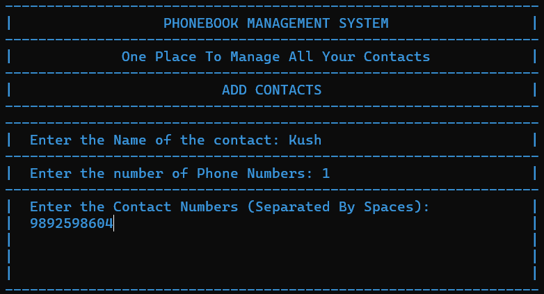
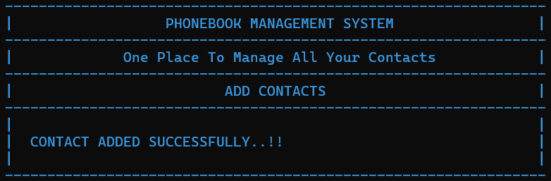

# Phonebook-System

- ### A Command Line Interface Program to keep track of your contacts
- ### The Program has following features:
    - Adding a new Contact
    - Removing an Existing contact
    - Searching for contacts with keywords
    - Editing an Existing contact
    - Displaying the List of contacts

- ### In order to use this program, you need to download the Source Code from Here.
- ### After downloading, open the folder containing `main.exe` and all the other supporting files.
- ### Open the folder in Terminal
- ### If you are using Command Prompt, simply type `main` and hit Enter.
```
D:\Kush3\Desktop\College\GitHub\Phonebook-System>main
```
- ### If you are in PowerShell, type `.\main.exe` and hit Enter.
```
PS D:\Kush3\Desktop\College\GitHub\Phonebook-System> .\main.exe
``` 

## The Program Looks Like 
<br>

### Main Page

<br>

### Adding a Contact



<br>



<br>

### Removing a Contact


<br>

### Searching a Contact


<br>

### Editing a contact


<br>

### Displaying the contact list

